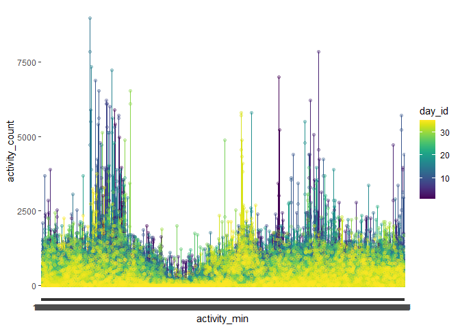
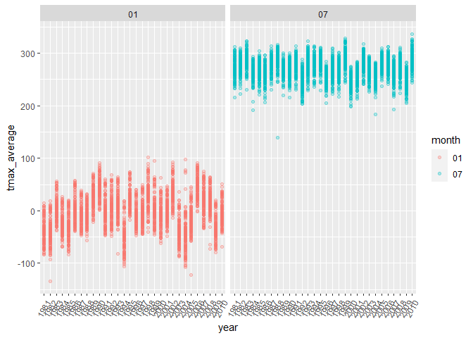
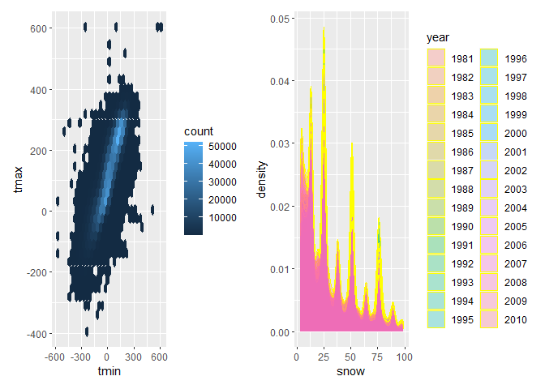

p8105_hw3_jc5929
================
2022-10-15

``` r
library(tidyverse) 
```

    ## ── Attaching packages ─────────────────────────────────────── tidyverse 1.3.2 ──
    ## ✔ ggplot2 3.3.6      ✔ purrr   0.3.4 
    ## ✔ tibble  3.1.8      ✔ dplyr   1.0.10
    ## ✔ tidyr   1.2.0      ✔ stringr 1.4.1 
    ## ✔ readr   2.1.2      ✔ forcats 0.5.2 
    ## ── Conflicts ────────────────────────────────────────── tidyverse_conflicts() ──
    ## ✖ dplyr::filter() masks stats::filter()
    ## ✖ dplyr::lag()    masks stats::lag()

``` r
library(ggridges) 
library(patchwork) 
library(dplyr)
library(knitr)
library(p8105.datasets)
```

**Question 1**

``` r
data("instacart")

instacart = 
  instacart %>% 
  as_tibble(instacart)
```

This dataset contains 1384617 rows and 15 columns, with each row
resprenting a single product from an instacart order. Variables include
identifiers for user, order, and product; the order in which each
product was added to the cart. There are several order-level variables,
describing the day and time of the order, and number of days since prior
order. Then there are several item-specific variables, describing the
product name (e.g. Yogurt, Avocado), department (e.g. dairy and eggs,
produce), and aisle (e.g. yogurt, fresh fruits), and whether the item
has been ordered by this user in the past. In total, there are 39123
products found in 131209 orders from 131209 distinct users

``` r
instacart %>% 
  count(aisle) %>% 
  arrange(desc(n))
```

    ## # A tibble: 134 × 2
    ##    aisle                              n
    ##    <chr>                          <int>
    ##  1 fresh vegetables              150609
    ##  2 fresh fruits                  150473
    ##  3 packaged vegetables fruits     78493
    ##  4 yogurt                         55240
    ##  5 packaged cheese                41699
    ##  6 water seltzer sparkling water  36617
    ##  7 milk                           32644
    ##  8 chips pretzels                 31269
    ##  9 soy lactosefree                26240
    ## 10 bread                          23635
    ## # … with 124 more rows

``` r
instacart %>% 
  count(aisle) %>% 
  filter(n > 10000) %>% 
  mutate(aisle = fct_reorder(aisle, n)) %>% 
  ggplot(aes(x = aisle, y = n)) + 
  geom_point() + 
  labs(title = "Number of items ordered in each aisle") +
  theme(axis.text.x = element_text(angle = 60, hjust = 1))
```

<!-- -->
Above is a plot that shows the number of items ordered in each aisle.
Here, aisles are ordered by ascending number of items.

``` r
instacart %>% 
  filter(aisle %in% c("baking ingredients", "dog food care", "packaged vegetables fruits")) %>%
  group_by(aisle) %>% 
  count(product_name) %>% 
  mutate(rank = min_rank(desc(n))) %>% 
  filter(rank < 4) %>% 
  arrange(desc(n)) %>%
  knitr::kable()
```

| aisle                      | product_name                                  |    n | rank |
|:---------------------------|:----------------------------------------------|-----:|-----:|
| packaged vegetables fruits | Organic Baby Spinach                          | 9784 |    1 |
| packaged vegetables fruits | Organic Raspberries                           | 5546 |    2 |
| packaged vegetables fruits | Organic Blueberries                           | 4966 |    3 |
| baking ingredients         | Light Brown Sugar                             |  499 |    1 |
| baking ingredients         | Pure Baking Soda                              |  387 |    2 |
| baking ingredients         | Cane Sugar                                    |  336 |    3 |
| dog food care              | Snack Sticks Chicken & Rice Recipe Dog Treats |   30 |    1 |
| dog food care              | Organix Chicken & Brown Rice Recipe           |   28 |    2 |
| dog food care              | Small Dog Biscuits                            |   26 |    3 |

A table showing the mean hour of the day at which Pink Lady Apples and
Coffee Ice Cream are ordered on each day of the week. This table has
been formatted in an untidy manner for human readers. Pink Lady Apples
are generally purchased slightly earlier in the day than Coffee Ice
Cream, with the exception of day 5.

``` r
instacart %>%
  filter(product_name %in% c("Pink Lady Apples", "Coffee Ice Cream")) %>%
  group_by(product_name, order_dow) %>%
  summarize(mean_hour = mean(order_hour_of_day)) %>%
  spread(key = order_dow, value = mean_hour) %>%
  knitr::kable(digits = 2)
```

    ## `summarise()` has grouped output by 'product_name'. You can override using the
    ## `.groups` argument.

| product_name     |     0 |     1 |     2 |     3 |     4 |     5 |     6 |
|:-----------------|------:|------:|------:|------:|------:|------:|------:|
| Coffee Ice Cream | 13.77 | 14.32 | 15.38 | 15.32 | 15.22 | 12.26 | 13.83 |
| Pink Lady Apples | 13.44 | 11.36 | 11.70 | 14.25 | 11.55 | 12.78 | 11.94 |

**Question 2**

``` r
accel_data=read_csv("data/accel_data.csv") %>%
  janitor::clean_names() %>%
  pivot_longer(
    activity_1:activity_1440,
    names_to = 'activity_min',
    values_to = 'activity_count',
    names_prefix = 'activity_'
  )  %>%
mutate(activity_count=round(activity_count,2)) %>%
  mutate(day_type=
        case_when(
     day== 'Monday' ~ 'weekday',
     day== 'Tuesday' ~ 'weekday',
     day== 'Wednesday' ~ 'weekday',
     day== 'Thursday' ~ 'weekday',
     day== 'Friday' ~ 'weekday',
     day== 'Saturday' ~ 'weekend',
     day== 'Sunday' ~ 'weekend')
   )
```

    ## Rows: 35 Columns: 1443
    ## ── Column specification ────────────────────────────────────────────────────────
    ## Delimiter: ","
    ## chr    (1): day
    ## dbl (1442): week, day_id, activity.1, activity.2, activity.3, activity.4, ac...
    ## 
    ## ℹ Use `spec()` to retrieve the full column specification for this data.
    ## ℹ Specify the column types or set `show_col_types = FALSE` to quiet this message.

``` r
accel_data %>%
  group_by(day_id,week,day) %>%
  summarize(n_obs=n(),
            total_activity=sum(activity_count)) %>%
  knitr::kable()
```

    ## `summarise()` has grouped output by 'day_id', 'week'. You can override using
    ## the `.groups` argument.

| day_id | week | day       | n_obs | total_activity |
|-------:|-----:|:----------|------:|---------------:|
|      1 |    1 | Friday    |  1440 |      480542.61 |
|      2 |    1 | Monday    |  1440 |       78828.18 |
|      3 |    1 | Saturday  |  1440 |      376254.00 |
|      4 |    1 | Sunday    |  1440 |      631105.00 |
|      5 |    1 | Thursday  |  1440 |      355923.72 |
|      6 |    1 | Tuesday   |  1440 |      307094.19 |
|      7 |    1 | Wednesday |  1440 |      340115.01 |
|      8 |    2 | Friday    |  1440 |      568839.00 |
|      9 |    2 | Monday    |  1440 |      295431.00 |
|     10 |    2 | Saturday  |  1440 |      607175.00 |
|     11 |    2 | Sunday    |  1440 |      422018.00 |
|     12 |    2 | Thursday  |  1440 |      474048.00 |
|     13 |    2 | Tuesday   |  1440 |      423245.00 |
|     14 |    2 | Wednesday |  1440 |      440962.00 |
|     15 |    3 | Friday    |  1440 |      467420.00 |
|     16 |    3 | Monday    |  1440 |      685910.00 |
|     17 |    3 | Saturday  |  1440 |      382928.00 |
|     18 |    3 | Sunday    |  1440 |      467052.00 |
|     19 |    3 | Thursday  |  1440 |      371230.00 |
|     20 |    3 | Tuesday   |  1440 |      381507.00 |
|     21 |    3 | Wednesday |  1440 |      468869.00 |
|     22 |    4 | Friday    |  1440 |      154049.00 |
|     23 |    4 | Monday    |  1440 |      409450.00 |
|     24 |    4 | Saturday  |  1440 |        1440.00 |
|     25 |    4 | Sunday    |  1440 |      260617.00 |
|     26 |    4 | Thursday  |  1440 |      340291.00 |
|     27 |    4 | Tuesday   |  1440 |      319568.00 |
|     28 |    4 | Wednesday |  1440 |      434460.00 |
|     29 |    5 | Friday    |  1440 |      620860.00 |
|     30 |    5 | Monday    |  1440 |      389080.00 |
|     31 |    5 | Saturday  |  1440 |        1440.00 |
|     32 |    5 | Sunday    |  1440 |      138421.00 |
|     33 |    5 | Thursday  |  1440 |      549658.00 |
|     34 |    5 | Tuesday   |  1440 |      367824.00 |
|     35 |    5 | Wednesday |  1440 |      445366.00 |

``` r
  accel_data %>%
  mutate(activity_min=as.numeric(activity_min)) %>%
  ggplot(aes(x=activity_min,y=activity_count,color=day))+
  geom_line()+labs(title = "24-Hour Activity Count by Day",
    x = "Time",
    y = "Activity Count",
    caption = "Data from the accel data"
  ) + 
  scale_x_continuous(
    breaks = c(0, 360, 720, 1080, 1440), 
    labels = c("12AM", "6AM", "12PM", "6PM", "11:59PM"),
    limits = c(0, 1440)
    )
```

<!-- -->

**Question 3**

``` r
library(p8105.datasets) 
data("ny_noaa")
ny_data= ny_noaa %>%
  janitor::clean_names() %>%
  mutate(date=as.character(date)) %>%
  separate(date,into=c('year','month','date'),sep='-') %>%
  mutate(tmax=as.numeric(tmax),tmin=as.numeric(tmin))

month_plot= 
    ny_data %>%
  filter(month=='01'|month=='07') %>%
  drop_na(tmax) %>%
  group_by(year,id,month) %>%
  summarize(tmax_average=mean(tmax)) %>%
  ggplot(aes(x=year,y=tmax_average,color=month)) +geom_point()+
  facet_grid(.~month)+theme(axis.text.x = element_text(angle = 60, hjust = 1))
```

    ## `summarise()` has grouped output by 'year', 'id'. You can override using the
    ## `.groups` argument.

``` r
month_plot
```

<!-- -->

``` r
plot1= ny_data %>%
    ggplot(aes(x=tmin,y=tmax))+geom_hex()
  
plot2 = ny_data %>%
    filter(snow>0 & snow<100) %>%
    ggplot(aes(x=snow,fill=year))+geom_density(alpha=0.3,adjust=0.5,
                                               color='yellow')
 
plot1+plot2
```

    ## Warning: Removed 1136276 rows containing non-finite values (stat_binhex).

<!-- -->
