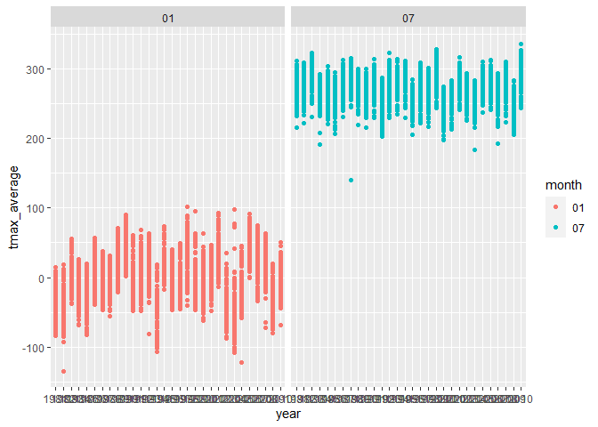

p8105_hw3_jc5929
================
2022-10-15

**Question 2**

``` r
library(tidyverse) 
```

    ## ── Attaching packages ─────────────────────────────────────── tidyverse 1.3.2 ──
    ## ✔ ggplot2 3.3.6      ✔ purrr   0.3.4 
    ## ✔ tibble  3.1.8      ✔ dplyr   1.0.10
    ## ✔ tidyr   1.2.0      ✔ stringr 1.4.1 
    ## ✔ readr   2.1.2      ✔ forcats 0.5.2 
    ## ── Conflicts ────────────────────────────────────────── tidyverse_conflicts() ──
    ## ✖ dplyr::filter() masks stats::filter()
    ## ✖ dplyr::lag()    masks stats::lag()

``` r
library(ggridges) 
library(patchwork) 
library(dplyr)
library(knitr)
accel_data=read_csv("data/accel_data.csv") %>%
  janitor::clean_names() %>%
  pivot_longer(
    activity_1:activity_1440,
    names_to = 'activity_min',
    values_to = 'activity_count',
    names_prefix = 'activity_'
  )  %>%
mutate(activity_count=round(activity_count,2)) %>%
  mutate(day_type=
        case_when(
     day== 'Monday' ~ 'weekday',
     day== 'Tuesday' ~ 'weekday',
     day== 'Wednesday' ~ 'weekday',
     day== 'Thursday' ~ 'weekday',
     day== 'Friday' ~ 'weekday',
     day== 'Saturday' ~ 'weekend',
     day== 'Sunday' ~ 'weekend')
   )
```

    ## Rows: 35 Columns: 1443
    ## ── Column specification ────────────────────────────────────────────────────────
    ## Delimiter: ","
    ## chr    (1): day
    ## dbl (1442): week, day_id, activity.1, activity.2, activity.3, activity.4, ac...
    ## 
    ## ℹ Use `spec()` to retrieve the full column specification for this data.
    ## ℹ Specify the column types or set `show_col_types = FALSE` to quiet this message.

``` r
accel_data %>%
  group_by(day_id) %>%
  summarize(n_obs=n(),
            total_activity=sum(activity_count)) %>%
  knitr::kable()
```

| day_id | n_obs | total_activity |
|-------:|------:|---------------:|
|      1 |  1440 |      480542.61 |
|      2 |  1440 |       78828.18 |
|      3 |  1440 |      376254.00 |
|      4 |  1440 |      631105.00 |
|      5 |  1440 |      355923.72 |
|      6 |  1440 |      307094.19 |
|      7 |  1440 |      340115.01 |
|      8 |  1440 |      568839.00 |
|      9 |  1440 |      295431.00 |
|     10 |  1440 |      607175.00 |
|     11 |  1440 |      422018.00 |
|     12 |  1440 |      474048.00 |
|     13 |  1440 |      423245.00 |
|     14 |  1440 |      440962.00 |
|     15 |  1440 |      467420.00 |
|     16 |  1440 |      685910.00 |
|     17 |  1440 |      382928.00 |
|     18 |  1440 |      467052.00 |
|     19 |  1440 |      371230.00 |
|     20 |  1440 |      381507.00 |
|     21 |  1440 |      468869.00 |
|     22 |  1440 |      154049.00 |
|     23 |  1440 |      409450.00 |
|     24 |  1440 |        1440.00 |
|     25 |  1440 |      260617.00 |
|     26 |  1440 |      340291.00 |
|     27 |  1440 |      319568.00 |
|     28 |  1440 |      434460.00 |
|     29 |  1440 |      620860.00 |
|     30 |  1440 |      389080.00 |
|     31 |  1440 |        1440.00 |
|     32 |  1440 |      138421.00 |
|     33 |  1440 |      549658.00 |
|     34 |  1440 |      367824.00 |
|     35 |  1440 |      445366.00 |

``` r
  accel_data %>%
  group_by(week) %>%
  ggplot(aes(x=activity_min,y=activity_count,color=day_id))+
  geom_line()+geom_point(alpha=0.3)+viridis::scale_color_viridis(name='day_id')
```

<!-- -->

**Question 3**

``` r
library(p8105.datasets) 
data("ny_noaa")
ny_data= ny_noaa %>%
  janitor::clean_names() %>%
  mutate(date=as.character(date)) %>%
  separate(date,into=c('year','month','date'),sep='-') %>%
  mutate(tmax=as.numeric(tmax),tmin=as.numeric(tmin))

month_plot= 
    ny_data %>%
  filter(month=='01'|month=='07') %>%
  drop_na(tmax) %>%
  group_by(year,id,month) %>%
  summarize(tmax_average=mean(tmax)) %>%
  ggplot(aes(x=year,y=tmax_average,color=month)) +geom_point()+
  facet_grid(.~month)
```

    ## `summarise()` has grouped output by 'year', 'id'. You can override using the
    ## `.groups` argument.

``` r
month_plot
```

<!-- -->

``` r
plot1= ny_data %>%
    ggplot(aes(x=tmin,y=tmax))+geom_hex()
  
plot2 = ny_data %>%
    filter(snow>0 & snow<100) %>%
    ggplot(aes(x=snow,fill=year))+geom_density(alpha=0.3,adjust=0.5,
                                               color='yellow')
 
plot1+plot2
```

    ## Warning: Removed 1136276 rows containing non-finite values (stat_binhex).

<!-- -->
